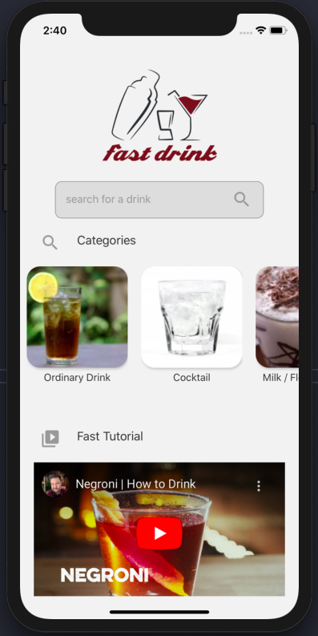
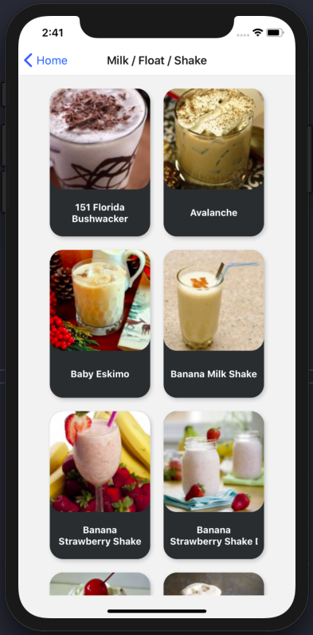

# MAZZAFC Test

## Install application:

### After downloading / cloning the application in the directory run:

`yarn install` This command will download all application dependencies.

for IOS application two more commands will be needed `cd ios` and `pod install`

### Execute application:

Android `npx react-native run-android`
IOS `npx react-native run-ios`

## features:

### Home page

<h4 align="center">
 
 <b>Home Page</b>
</h4>

This page allows you to search for drinks, list the categories and show some video tutorials.

### Drinks page

<h4 align="center">
 
 <b>Drinks Page</b>
</h4>

This page lists the drinks of a selected category on the Home page or the drinks from the drinks search

### DrinksDetails

<h4 align="center">
 
 <b>DrinkDetails Page</b>
</h4>

this page shows an image of the drink, its type (alcoholic or non-alcoholic), its ingredients and its method of preparation.

### API Data

this application consumes the data from the [thecocktaildb](https://www.thecocktaildb.com/)
